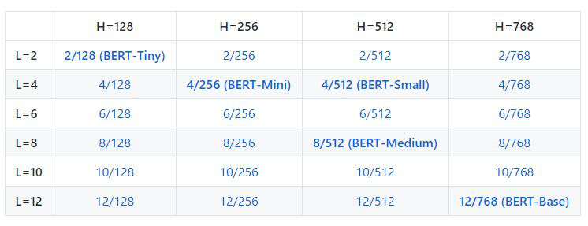

# Open Domain Question Answering with BERT
This work was done for Santa Clara University's Natural Language Processing course taught by Professor Ming-Hwa Wang

## Introduction

 We implemented BERT, a deep learning model built from transformers, on Google's Natural Questions (NQ) Dataset. We augmented the training data using synonym replacement and found that this improved the F1, Precision, and Recall of both the long and short answers. We also concluded that model size heavily impacts the overall system performance but reasonable performance (see results section) can be achieved with significantly reduced model complexity. 

BERT model found **[here](https://github.com/google-research/bert)**

## Problem Statement
Machine Reading Comprehension (MRC) is a sub-field of Natural Language Understanding (NLU) that deals with the process of building machines capable of understanding or comprehending natural language text. Given that understanding text and being able to answer questions about it is something that is generally associated with intelligence, question answering (QA) has become a key benchmark task in the development of general artificial intelligence. However, given the complexity of QA and the sheer amount of data needed to train any given language model, there are only a handful of high quality labeled training datasets that exist today. One of the most popular of these datasets is [SQuAD (Stanford Question Answering Dataset)](https://rajpurkar.github.io/SQuAD-explorer/), a reading comprehension benchmark consisting of questions posed on a set of Wikipedia articles. The answer to every question is either a segment of text from the corresponding reading passage or the question is unanswerable (the question cannot be answered based on the passage provided). In order for a question to be answered correctly, the prediction must match one of the ground truth answers. As impressive as the SQuaD dataset is, it does not fully represent the true nature of QA. The standalone passages tend to be relatively short and ignore the verbose explanations of any given topic as typically seen on Wikipedia. Real QA tends to be more "open-domain", meaning that an answer to a question must be synthesized from a vast amount of unstructured information. The subject matter relevant to answer them is not constrained to any domain and the machine has to rely solely on world knowledge. In an effort to help tackle this issue, [Google released Natural Questions (NQ) corpus in 2019](https://ai.google.com/research/NaturalQuestions/dataset), a dataset containing entire Wikipedia articles with question answer pairs from real users. The challenge presented here is that the passage lengths are much longer, reflecting a more realistic scenario that tends to occur with comprehending an open-domain question. While this dataset is still not a truly open-domain knowledge source, it serves as a stepping stone to building systems capable of retrieving relevant articles from a large source, digesting them, and then delivering an intelligent response.

## Prior Research
BERT (the model used in this work), was an architecture built from the compound research efforts of neural networks designed for machine translation, specifically converting one language to another. These networks are called sequence-to-sequence models and are typically made up of an encoder and a decoder where the encoder takes an input sequence and maps it into a higher dimensional space (n-dimensional vector) and the decoder takes this abstract vector and turns it into an output sequence. In order to accomplish this, some form of a Recurrent Neural Network (RNN) is used for the guts of the processing, namely Long Short-Term Memory or Gated Recurrent Unit (GRU) networks. The respective RNN’s are stacked together in such a way that each element accepts the output of the previous, therefore “collecting information” and thereby propagating it forward. The efficacy of these models lies in the fact that each neuron of the RNN has feedback to itself, different from a feed-forward neural network where information strictly propagates forward with no feedback. This idea of feedback is precisely what makes these networks capable of interpreting sequences of data, whereby parts of the input can and generally are related to each other in some way. However, as an input sequence grows in size, the RNN’s ability to capture the relationship between distant sequences diminishes greatly. The reason for this issue comes from a common complication in deep neural networks called the vanishing gradient problem. During backpropagation, a network’s weights receive an update proportional to the partial derivative of the error function with respect to the current weight in each iteration of training. With deep networks, the gradient can become so small that the weights change very slowly or even not at all. As a result, the RNN can have a difficult time with long sentences because it “forgets” the previous input. Essentially the fundamental problem at hand is that any given language model needs to have the ability to associate words in a sentence that are not necessarily next to each other, a problem that becomes even more complex when extrapolated out to sentence to sentence relationships or even paragraph to paragraph. In an effort to eliminate this drawback, the idea of an Attention Mechanism was introduced. Instead of building an encoder and decoder where the processing is done sequentially, each input is allowed to contribute to the output, allowing for better memory retention and word relationship understanding. Up until 2017, this was considered the state-of-the-art architecture for sequence to sequence models and an industry standard for successful machine translation. This changed however when Google Research published a paper called *[Attention Is All You Need](https://arxiv.org/abs/1706.03762)* describing a deep learning model called a Transformer which built off the idea of attention but without using an RNN. The Transformer not only was able to do a better job of handling long input sequences but also did not require sequential data to be processed in order. As a result the model showed to be superior in quality on two machine translation tasks while also being more parallelizable and requiring significantly less time to train. It still adopted the encoder-decoder architecture but unlike the traditional sequence to sequence models, the encoder and decoders were stacked together, with the output of each encoder feeding into the input of each decoder.  

## Models

### [BERT](https://github.com/google-research/bert)

One such application of the Transformer is BERT, a language model standing for Bidirectional Encoder Representations from Transformers. Created and [published by Google AI Language Research Lab in 2018](https://arxiv.org/abs/1810.04805), it went on to achieve state of the art performance on several NLU datasets. It also won the Best Long Paper Award at the 2019 NAACL (North American Chapter of the Association for Computational Linguistics). BERT’s key innovation was applying the bidirectional training of the Transformer to language modeling. A traditional statistical language model is built with the intention to determine the probability of a given sequence of words. Historically this has been done with n-gram models, shallow bidirectional models, or maximum entropy models. What sets BERT apart is that it is deeply bidirectional, an architecture that was previously impossible until the introduction of the Transformer. Keep in mind that since it is a language model, only the encoder of the Transformer is needed. There are two training phases to BERT, a pre-training phase and a fine-tuning phase. The pre-training phase consists of two unsupervised predictive tasks whereby the structure of the input is learned through unlabeled data. These two learning objectives are then combined together to create the loss function for BERT, with the weights and matrices of the Transformer adjusted to minimize the error. One of the most powerful aspects of BERT is the fact that once it has been pre-trained, it can be fine-tuned for many different language tasks such as sentiment analysis, question answering, or even named entity recognition.

A detailed presentation of the inner workings of BERT can be found [here](./BERT_explained.pdf)

Since the initial publication of BERT, there have been many different model sizes released. Given the computational resources needed to run BERT, it was deduced by Google’s research team that smaller models would be imperative for the general public to use and implement.

<p align="center">
  
</p>

Each row refers to how many stacked encoders the model contains and each column is how many hidden units the feed forward network contains.  

### Our Model

For our solution, we decided to use BERT Tiny with a pre-processing layer that expands the overall vocabulary, hence diversifying the input to create a more generalized understanding. The preprocessing layer does synonym replacement on each training sample, replacing a random selection of vocabulary words with the top ranked synonym. We used the [WordNet library from NLTK](https://www.nltk.org/howto/wordnet.html) to do this.

For each word answer, we
- 20% of the time used WordNet to replace a word with synonym
  - if synonyms exist: randomly choose a synonym from word list
  - if synonym does not exist: replace the word with a random word from the BERT vocabulary
- 80% of the time word is left unchanged

Unlike datasets like SQuAD, which have only one context to infer the answer to a question from, the NQ dataset has an entire HTML document to peruse and understand. Thus, it poses a much more difficult task to infer answers from these very large units of text. Therefore, we need to first extract the most probable context units from these large documents first, in order to make the task at hand more feasible. Fortunately, each training example already has token spans of the most probable candidate contexts in the form of candidate_long_answers, which correspond to three different context types: pieces of text wrapped by a paragraph, table, or list HTML tags. Furthermore, each candidate answer has a boolean is_top_level attribute which denotes whether the corresponding candidate is important or not to be considered in inferring the answer to the question. Therefore, our model further processes these training examples to extract these candidate answers. Each candidate answer is padded with two padding tokens [‘Context_id’] and [‘Context_type’] and appended into a master string variable Contexts. This string will in turn be fed as the corresponding context to infer the answer from. It must also be noted that in order to accomplish the task of question/answering, we added a \<BEG\> and \<END\> token into the model in order for the system to learn where the answer to a question begins and ends.

<p align="center">
  
</p>

## Datasets

### [Google NQ Dataset](https://ai.google.com/research/NaturalQuestions/dataset)

*Note: This dataset is not provided in this repository for size reasons*

The NQ corpus contains questions from real users, requiring QA systems to read and comprehend an entire Wikipedia article that may or may not contain the answer to the question. The dataset contains 307k training examples (41Gb) and 8k validation examples (1Gb) for development. For each question there is a short answer and a long answer. The short answers tend to be only a couple words long, directly addressing the question with no other contextual information. The longer answers can be several sentences in length, providing the answer to the question but also supporting contextual details. Google reports a human upper bound of 87% F1 on the long answer selection task and 76% on the short answer selection task. The best scores are by private industry research groups, all of which are still currently being outperformed by the average human score. In order to download the data, a tool called gsutil needs to be used. The link to install the tool can be found [here](https://cloud.google.com/storage/docs/gsutil_install). Once the tool has been installed, run the following command 

```sh
    gsutil -m cp -R gs://natural_questions/v1.0 <path to your data directory>
```

The training data is broken up into 50 different zipped files, each containing approximately 6k samples each. The validation set is broken up into 5 zipped files, each containing 1600 samples. The NQ data can be represented in two different ways, a full rendered version of the HTML or a simplified version. In the full version, each sample in the original NQ format contains the rendered HTML of an entire Wikipedia page, as well as a tokenized representation of the text on the page. The simplified version removes much of the HTML formatting resulting in just the extracted text of each webpage. We chose to use the full rendered version of the dataset for two reasons. First, the raw HTML allows BERT to learn the structure of the web page and extract positional information from the text, potentially lending to a better understanding of each sample. Second, the validation set is only provided in the rendered HTML format, not the simplified format. While there is a script to convert to the simplified structure, we found it simpler to just use the full rendered version. 


## Performance Metrics

To determine answer performance, we used [these scripts generated by Google](https://github.com/google-research-datasets/natural-questions)

The metrics used to identify QA performance are F1, Precision, and Recall. However, since these metrics are binary in the sense that they require an answer to be either correct or incorrect, how does one determine if the long or short answer is accurate? There are different ways to state an explanation of something, several of which could be linguistically different but provide the same correct explanation. This is a rather nuanced question and is addressed in a paper published by Google called *[Natural Questions: a Benchmark for Question Answering Research](https://research.google/pubs/pub47761/)*

## Training

While we acknowledge that using a larger model will almost certainly guarantee better performance, we were limited with a time budget and hardware. With this in mind, we used the BERT TINY model because it was smaller and easier to train. We used Santa Clara’s High Performance Computer (HPC) which gave us access to an NVIDIA V100. 

With a training set of 300k samples it took ~32 hours to train. Not surprisingly, we found that between 0-100k samples there is a large increase in F1 score and then steadily increases until about 230k samples. After that, the performance begins to taper off and we don’t achieve as large of a boost in performance when increasing the training size. We used the same hyperparameters (suggested by Google) throughout each iteration in the graph seen below.

<p align="center">
  
</p>


## Results

<p align="center">

| Dataset                         | Long Answers F1 | Short Answers F1 | 
|:------------------------------: | :-------------: | :--------------: | 
| BERT Tiny (Our Model)           | 0.455           | 0.248            | 
| BERT Large (Google Baseline)    | 0.616           | 0.562            | 
| Best on Leaderboard (Microsoft) | 0.779           | 0.641            | 

<p>

<p align="center">
F1 results when training with 300k samples
<p>

What we see is that our model is vastly outperformed by a larger model size. This is expected given that BERT Tiny is the smallest model size provided by Google. 

* BERT Large: 16 encoders with 1024 hidden units in feed forward network
* BERT Tiny: 2 encoders with 128 hidden units in feed forward network

The number of weights in BERT Large is on the scale of millions more than BERT Tiny which allows for a much more tunable and flexible model. With that said, it is actually rather surprising that we achieved as high of an F1 as we did. To obtain better performance, the number of weights and time needed to train is many magnitudes larger.

<p align="center">

| Long Answers             | F1     | Precision |  Recall  | 
|:-----------------------: | :----: | :-------: | :------: |
| BERT Tiny w/o synonyms   | 0.455  | 0.414     | 0.505    | 
| BERT Tiny w/ synonyms    | 0.487  | 0.461     | 0.516    | 

| Short Answers            | F1     | Precision |  Recall  | 
|:-----------------------: | :----: | :-------: | :------: |
| BERT Tiny w/o synonyms   | 0.248  | 0.203     | 0.318    | 
| BERT Tiny w/ synonyms    | 0.263  | 0.239     | 0.292    | 

<p>

What we see from the tables above is that synonym replacement improves performance in both the long and short answer cases with a 0.032 and 0.015 F1 improvement, respectively. One particularly abnormal case that we suspect could be impacting the short answer performance is the number of Yes or No questions. Of the 300k training samples, only about 1% of them are binary. They are considered a 'short answer' but we believe that there is not enough of them to properly train the model. The same goes for questions that have no answer. Off the 300k training samples, about 14% of them do not have an answer. The task of understanding that the answer is not present amongst the provided corpus of information is much more difficult and we feel that our model (and any other), would perform better with more training samples.

## Conclusion

To improve Machine Reading Comprehension, there has been a research push to develop datasets that create a more realistic training scenario for open-domain question answering. We implemented BERT, a deep learning model built from transformers, on Googles NQ Dataset. While we were unable to train the larger BERT models due to hardware limitations, we augmented the training data using synonym replacement. In doing this we found that it improved the F1 of both the long and short answers. We also concluded that model size heavily impacts the overall system performance but were surprised by how well our design was able to perform given the dramatic reduction in model complexity.

## Usage

**WARNING**: This code requires TensorFlow 1, it is not compatible with TensorFlow 2. We used TensorFlow 1.14 but suspect the project is compatible with older versions of the TensorFlow framework.

Folder Structure
* demo_60k - BERT model fine-tuned on 60k training examples
* demo_syn - BERT model fine-tuned on 90k training examples (60k original, 30k synonym replacement)
* build_training_record - Contains code to build a training record
* build_training_record_syn - Contains code to build a training record w/ synonym replacement
* nq-dev-00.jsonl.gz - 1600 sample dev set
* nq-dev-sample.jsonl.gz - 200 sample dev set
* train_0-10_record - compressed training feature vectors (from 60k training samples) 
* train_syn_0-10_record - compressed training feature vectors (from 60k training samples augmented to 90k with synonym replacement)

Note: .gz files are compressed training and validations samples. We did not include all of them (too large) but include
a small set for demo purposes

***
How to build predictions file:

The predictions file is dumped in a .json format. Run the command below in either demo folder to generate the predictions 

```sh
python mainHPC.py
```

How to get performance metrics (F1, precision, recall):

Once the predictions file has been generated, run the command below to compare the predictions file to the raw evaluation training file (.gz). 

```sh
python nq_eval.py
```
The script will dump F1, precision, and recall for both long and short answers.

How to train the model from scratch:

In both demo folders, the “ensemble” directory contains the post trained BERT model weights. BERT looks at this folder during prediction time in order to reload all of its weights that it learned during training. To re-train BERT from scratch follow the steps below. 
1. Delete the “ensemble” directory
2. Inside mainHPC.py, change the *to_train* variable of the *runBERT* function from False to True. This tells BERT to train on the record specified by the ‘trainfile0’ variable
3. Run mainHPC.py - this should take 4~5 hours depending on the hardware being used. 

How to build training record from scratch:

In both demo folders, there is a file called ‘train_***_record’. This record contains the feature vectors that BERT uses to train. This record is built from the training .gz files. In order to build this from scratch, follow the steps below
1. Using extract_train_set.py, specify how many .gz files you want to compress into one using the num_train variable. This script will load each .gz file and compress them into a master .gz file that can be used to generate the record
2. Once the master .gz file has been created, run prepare_nq_data.py. Change the “input_jsonl” flag to the name of the master .gz file and change the “output_tfrecord” flag to the name of the record you want to create
3. Run prepare_nq_data.py 
